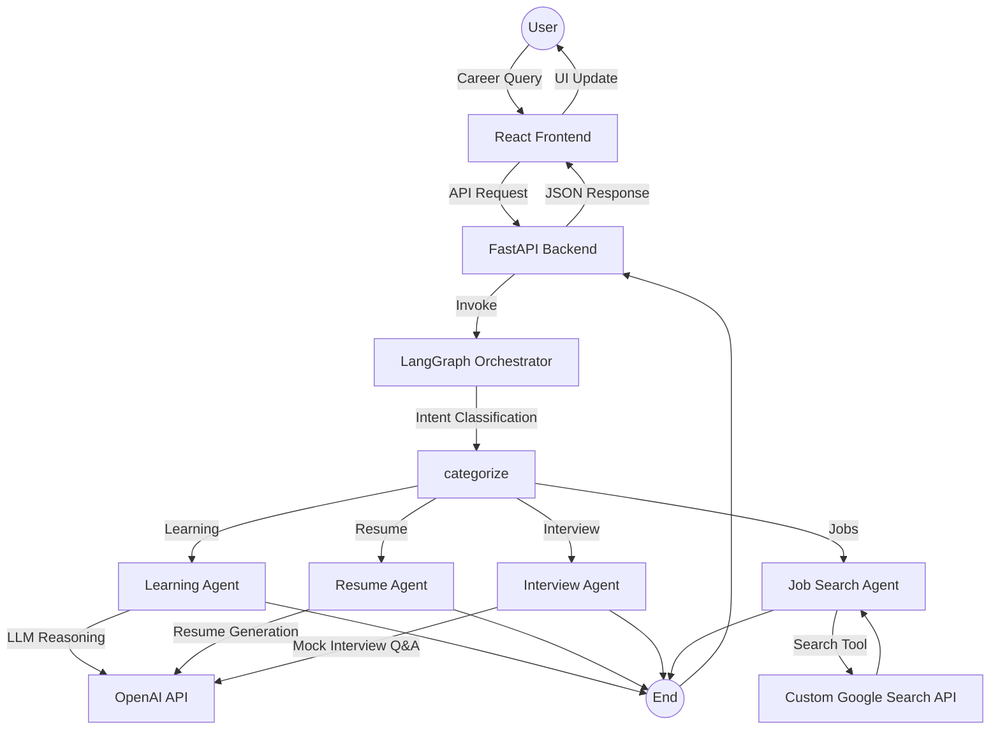

# CareerForge AI

[](https://reactjs.org/)
[](https://fastapi.tiangolo.com/)
[](https://www.langchain.com/)
[](https://github.com/langchain-ai/langgraph)
[](https://platform.openai.com/)
[](https://developers.google.com/custom-search)

**CareerForge AI** is an **agentic AI–powered career guidance platform** that uses multiple specialized AI agents to help users learn skills, build resumes, prepare for interviews, and search for jobs. Instead of isolated tools, CareerForge delivers a **unified, intelligent career assistant** powered by structured agent orchestration.

---
## System Architecture & Workflow

The platform uses a **LangGraph-based agent orchestration engine** where user intent is classified and routed to the appropriate specialized agent.


## Key Features

### Agentic AI System
- Multiple autonomous, task-specific AI agents  
- Clean separation of responsibilities  
- Scalable and extensible design  

### Intelligent Intent Routing
- User queries are automatically categorized and routed using **LangGraph**
- No manual mode or agent selection required

### Learning Agent
- Personalized learning guidance  
- Skill roadmaps and concept explanations  

### Resume Agent
- Resume generation and improvement  
- Role-specific resume tailoring  

### Interview Agent
- Mock interview simulations  
- Interview topic preparation and Q&A  

### Job Search Agent
- Uses a **Custom Google Search API**
- Finds real-world job opportunities dynamically  

---

## Tech Stack

Frontend
- **Framework:** React (Vite)  
- **Styling:** Tailwind CSS  
- **Animations:** Framer Motion  
- **HTTP Client:** Axios  

Backend
- **Language:** Python 3.9+  
- **Framework:** FastAPI  
- **Agent Orchestration:** LangGraph  
- **Agent Utilities:** LangChain  

### AI & Tools
- **LLM Provider:** OpenAI API  
- **Search Tool:** Custom Google Search API  
- **Architecture:** Agentic AI (multi-agent system)  

---

## Installation & Local Setup

Backend Setup
```bash
cd backend
pip install -r requirements.txt
python -m uvicorn app.main:app --reload
```
Frontend Setup
```bash
cd frontend
npm install
npm run dev
```
## Example Use Cases
- “Create a resume for a data science fresher”
- “Conduct a mock interview for a backend developer role”
- “What should I learn to become a machine learning engineer?”
- “Find entry-level Python jobs”

Each query is automatically handled by the **appropriate AI agent**.


